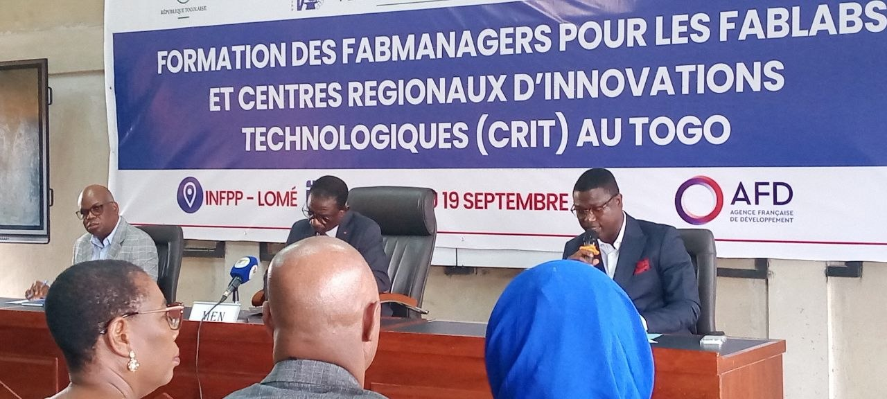

# JOURNAL DU 24 AOÛT 2026

## RESUMER LA JOURNNE

- [ OK ] parler de la ceremonie d'ouverture
- [ OK ] parlet de la pause obtenu après vode democratique
- [ ] parler de markdown
- [ ] parler du site [GITHUB](https://github.com)
- [ ] 
---
1. Tout à commencer par la ceromonie d'ouverture presider par l'INFPP, le FNAFPP et le MEN.

2. Pendant que nous nous preparons à la photo de famille,  les officiels faisaitent le tour des differentes machine le tout couvert par la television nationale (TVT) 

3. S'en es suivi d'un vote democratique pour savoir comment repositionnée la pause.

---
### PAUSE DE 12h15 à 13h30
---

4. L'apres pause fut consacré non seulement aux presentations mais aussi au premier module qui parle de la documentation.

5. la journne s'acheva à 17h15 avec pour exercice, le rapport que voici et un compte github.

---

> Ainsi fini mon rapport de ce 24 août 2026.

---

signé **Ing. Wisdom K. M. YAOU**