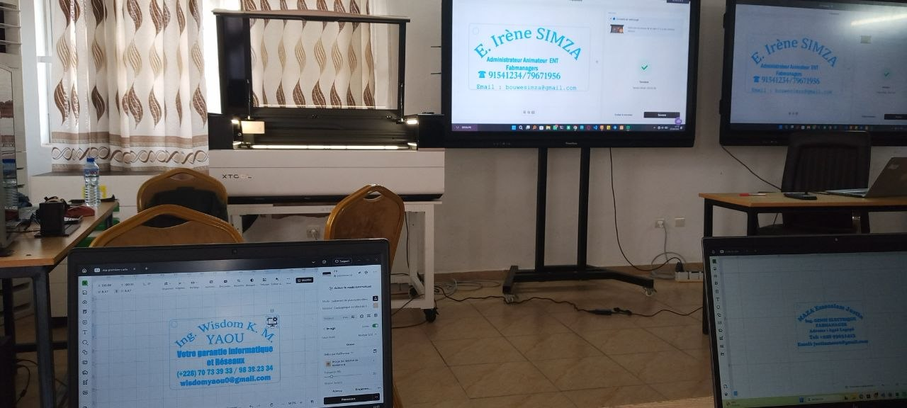

# JOURNAL DU 27 AOÛT 2026

## RESUMER LA JOURNNE

- [ ] debut par la verification de presence
- [ ] Le groupe 4 est en salle 1 (Le projet)
- [ ] 

> apres le projet ce fut la salle laser

# 2. la salle laser :
que je prefere appeler "salle Xtools" avec la "metalfab" dont j'admire le nom depuis sa connaissance. *(METALFAB dans un FABLAB)* nous avons concu une carte de visite qui serais imprimer sur un contreplaquer.

*Vu qu'une image vaut mille mots :*

 

---
### PAUSE DE MIDI

---

# 3. L'ELECTRONIQUE :
s'il faut le resumer je dirais juste makeblock + la cyberPi.

> nous les avons tous manipuler

# 4. LA SALLE 3D :
Tu connais les poses telephones en formes de porte-cle ? moi je l'ai imprimer personellement a cette date pour la premiere fois.

> Ainsi fini mon rapport de ce 27 août 2026.

---

signé **Ing. Wisdom K. M. YAOU**