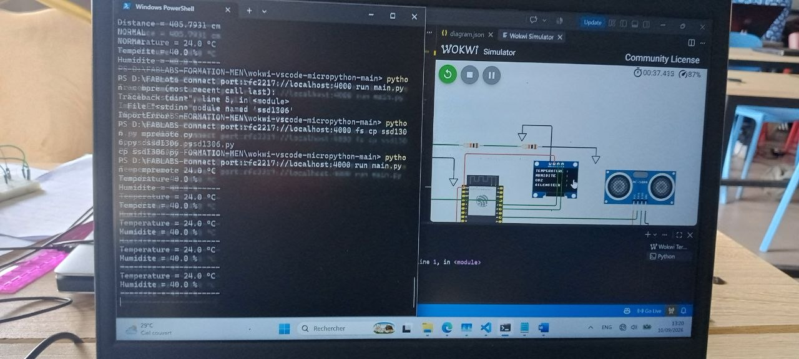
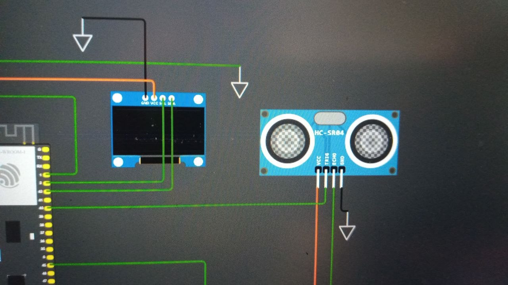
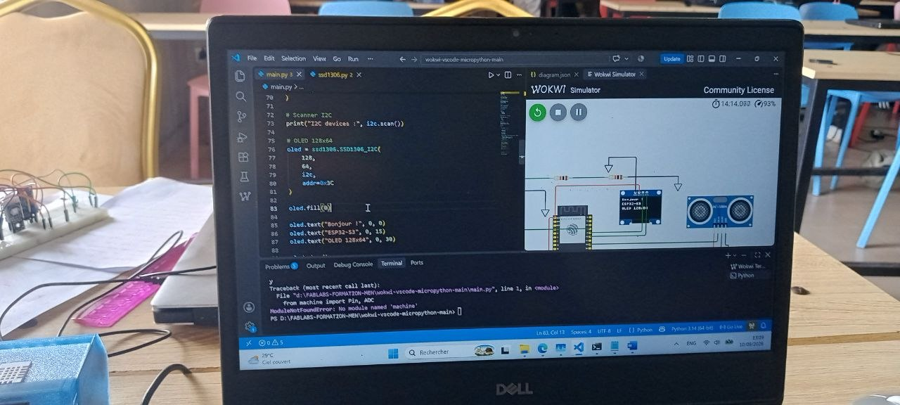
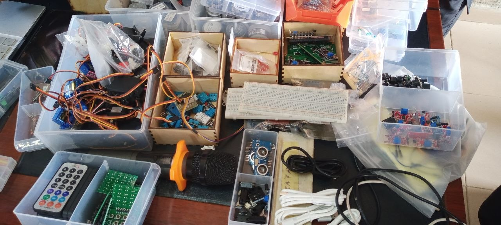
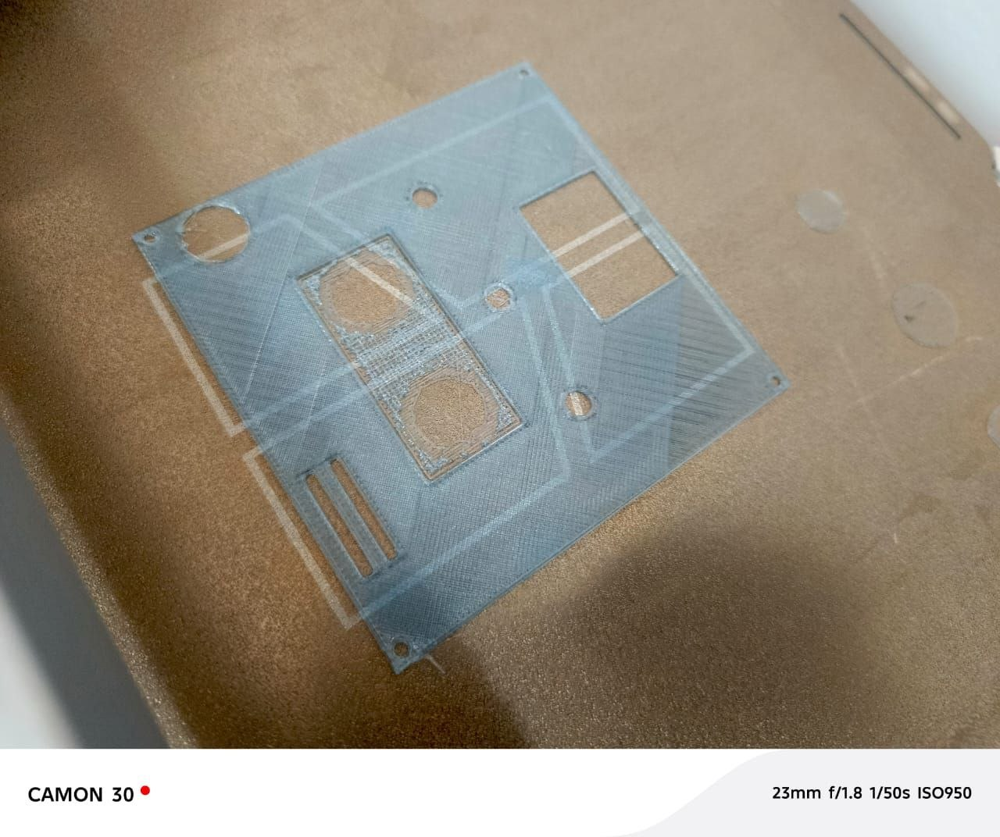
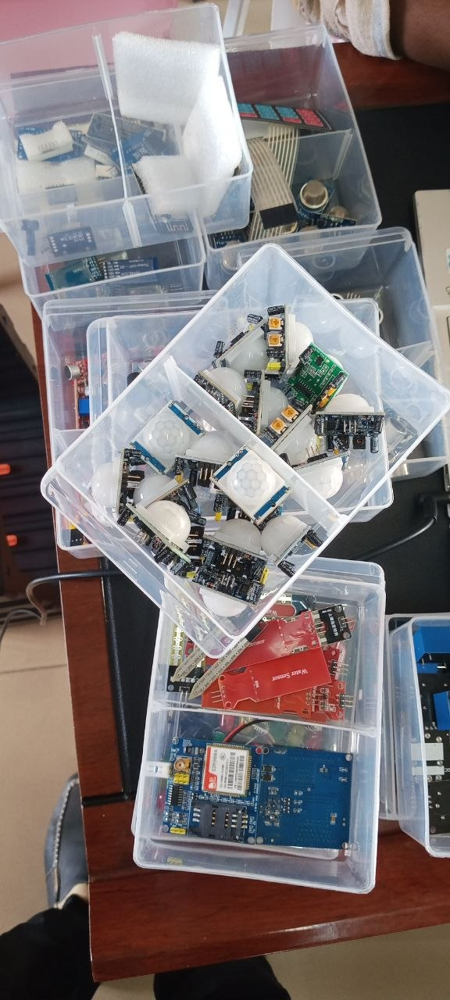
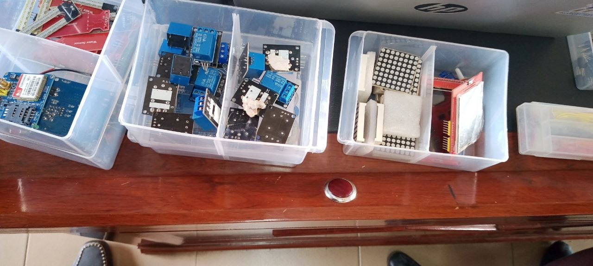
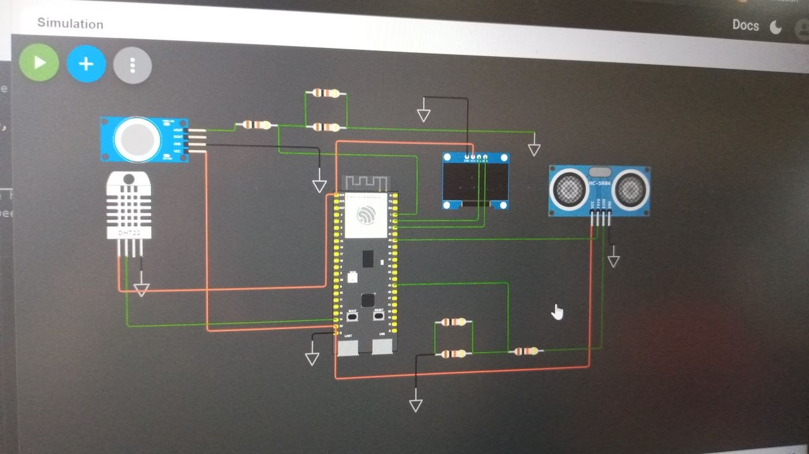

# JOURNAL DU Jeude 10 septembre 2026

## RESUMER LA JOURNNE

- [ ] La journee fut consacre a nos projets
- [ ] j'etait responsable du code micropython et de l'elecronique

## j'ai apris quoi ?
- Metre en place mon propre wokwi en local en utilisant wokwi et python,
- Comment cree un pond diviseur de tension avec trois resistances identiques, 
- Gerer un systeme avec differents railles d'alimentation (3v et 5v) dans mon cas
- Savoir quand et comment proteger ma carte esp32 avec des composant qui generent du 5v
- Compris mieux le principe de copier le code des bibliotheques externe sur l'esp32 avant de les importer et utiliser 

## j'ai rate quoi ?
1. j'ai tellement fais d'erreur en electronique que moi meme je fut surpris de la disparité entre ma perception et le concret. heuresement que c'etait en simulation.
2. au niveau du code j'ai du eponger tellement de documentation que sans l'aide de l'ia pour aller a l'essentiel je n'aurais pas ete aussi productif. par contre comme a son habitude l'ia crache des betises et si tu n'ai pas vigilent il t'envoie directement dans un mure avec un applond deconcertant

## images d'ilustrations :
> voici quelques images d'ilustrations prisent a des moments tout a fait random. il y a beaucoup de correction apres donc excuser d'avance les erreurs de cablable et de code :

## Decision pour demain 
> C'est decidé demain je termine le test unitaire de chaques composant du projet

signé **Ing. Wisdom K. M. YAOU** 10-09-2026
