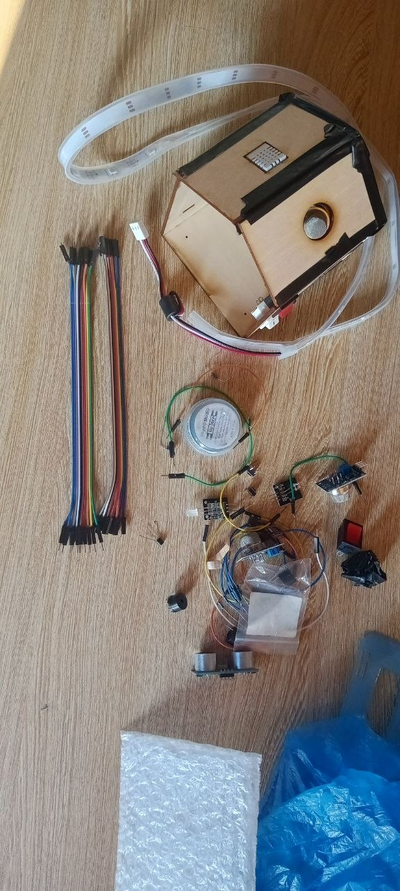
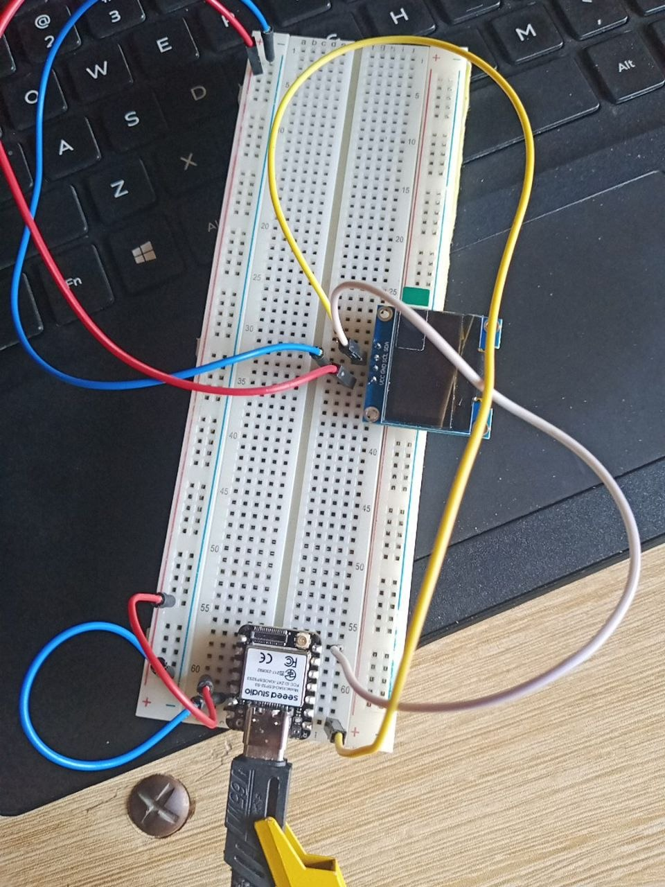
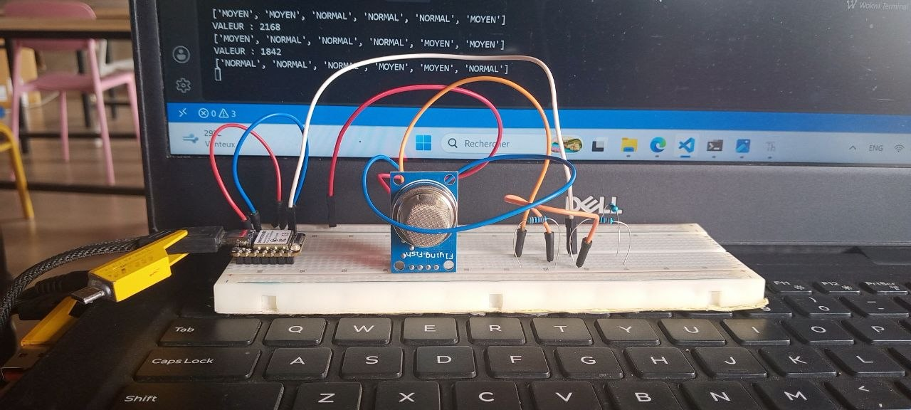
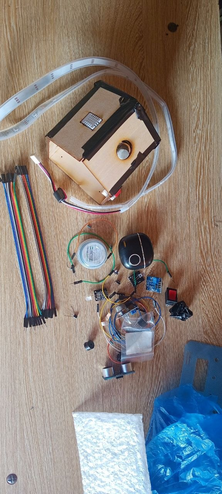
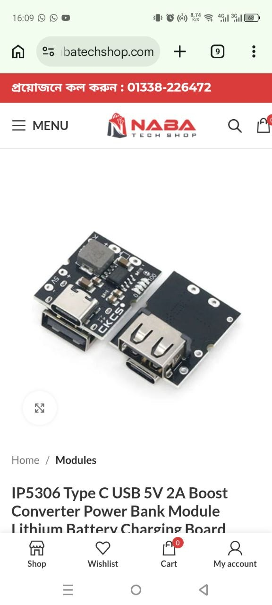

# JOURNAL DU Vendredi 11 septembre 2026

## RESUMER LA JOURNNE

- [ ] Ce fut une journee consacrer aux projets D22
- [ ] j'ai pu tester les composant et faire mes tests unitaire saul le dht22
- [ ] on a eu a faire un premier prototype en contre plaquer sour forme de maison pour tester

## j'ai apris quoi ?
- les test unitaires en electronique
- les transistors, ...

## j'ai rate quoi ?
1. j'ai passer beaucoup de temp sur le test de mon ecran car je prenais les numeros des digitals pin pour mettre a la place des numeros gpio

## images d'ilustrations :
> voici quelques images d'ilustrations prisent a des moments tout a fait random. il y a beaucoup de correction apres donc excuser d'avance les erreurs de cablable et de code :

## Decision pour demain 
> C'est decidé demain je m'attaque aux PCB

signé **Ing. Wisdom K. M. YAOU** 11-09-2026
